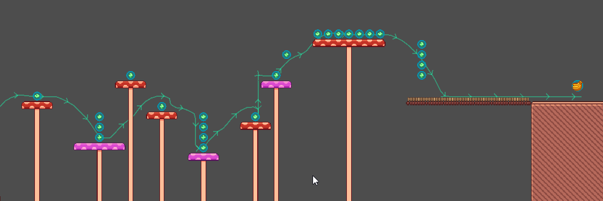

# GhostTrail
GhostTrail is a Godot 4 addon that enables you to record playthrough ghosts and visualize them in the editor as a trail. Scene changes will also be recorded and displayed.

## Table of Contents
- [Download](#download)
- [Usage](#usage)
- [Demo](#demo)
- [Donations](#donations)
- [License](#license)

## Download
Download the latest release [from GitHub](https://github.com/LauraWebdev/godot-ghosttrail/releases).

## Usage
Simply add the **GhostTrailRecorder** node as a child to your player node. If you have multiple player nodes (eg: one for your main character and one for your map scene), you can add the **GhostTrailRecorder** to both nodes. The addon will record the movement of all nodes and display them in the editor.

### Scene change / reload
The addon also displays scene changes and reloads. Each scene change / reinstantiation of the player node will be displayed as it's own path, this is especially useful to display player deaths. If the scene changes to a different scene, the editor will add a label that tells you where this trail continues. The trail in the second scene also displays where this trail originated from.

## Demo
Within this project, there is a playable demo that showcases the features of this addon.

## Donations
If you would like to support my open source projects, feel free to [drop me a coffee (or rather, an energy drink)](https://ko-fi.com/laurasofiaheimann) or check out my [release games](https://indiegesindel.itch.io) on itch.

## License
This project is licensed under the MIT License. For more information, check out the included [LICENSE](LICENSE) file.